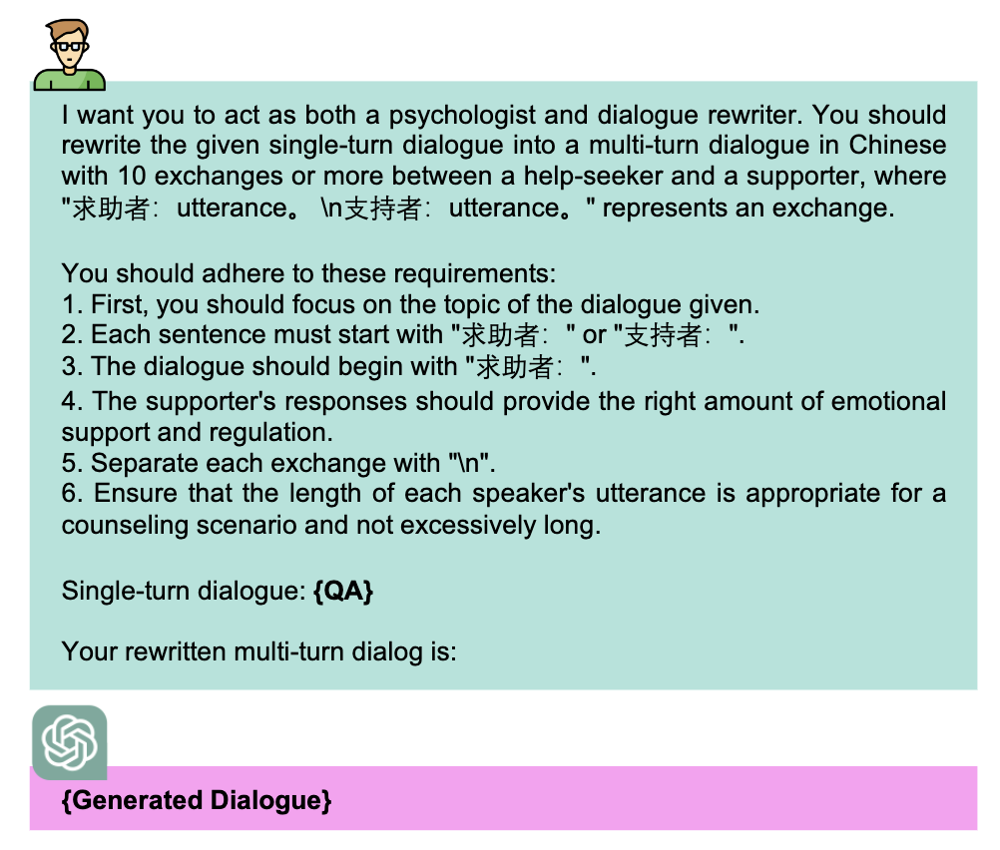

<p align="center">
  
</p>

# 中文心理健康支持对话数据集(SmileChat)与大模型(MeChat)

  <a href='https://arxiv.org/pdf/2305.00450.pdf'></a>

## 项目简介

🎉🎉🎉 **Here, we present an enhanced (high-quality) version of our SmileChat dataset. For the older version, please refer to the v1 branch.**

**MeChat** (**Me**ntal Health Support **Chat**bot)

我们的愿景是为让所有人在遇到心理健康问题时能够获得及时、有效的倾听和支持。我们相信，心理健康是每个人的权利，而不是奢侈品。我们的使命是**为人们提供平等、全面、易于访问的心理健康服务**，无论他们身在何处、面临何种挑战。我们的愿景还包括推动社会对心理健康问题的认识和理解，**打破心理健康问题带来的污名和歧视**，为创建一个更加健康、包容和平等的社会做出贡献。

**数据集说明**：数据集通过 ChatGPT 改写真实的心理互助 QA 为多轮的心理健康支持多轮对话（single-turn to multi-turn inclusive language expansion via ChatGPT），该数据集**SmileChat**含有 **55,165k** 个多轮对话，其对话主题、词汇和篇章语义更加丰富多样，更加符合在长程多轮对话的应用场景。数据目录说明如下：

本项目开源的**中文心理健康支持模型**由 ChatGLM2-6B LoRA 指令微调得到。数据集通过扩展**真实的心理互助 QA**为多轮的心理健康支持多轮对话，提高了通用语言大模型**在心理健康支持领域的表现**，更加符合在长程多轮对话的应用场景。

> 作为一款心理健康支持对话陪伴机器人，我能够和你聊天，提供情感支持和心理疏导。

## SMILE 方法

55k 对话，使用 PsyQA 生成了一轮，并使用自动化过滤：保证轮数不低于 5，符合对话格式，方法如下：

<p align="center">
  
</p>

### 模型地址

https://huggingface.co/qiuhuachuan/MeChat

### 体验地址

https://mechat.fly.dev/ （UI 代码见 web 目录，部署可参考[教程](https://dev.to/willydouhard/how-to-deploy-your-chainlit-app-to-flyio-38ja)）

## 快速开始

1. 配置环境

```bash
pip install -r requirements.txt
```

2. 运行交互文件 MeChat_local.py（要求单卡显存 >= 20G），运行脚本前需指定 cuda ，`os.environ['CUDA_VISIBLE_DEVICES'] = '${cuda_id}'`

```bash
python MeChat_local.py
```

## 模型训练

### 1、数据转换

- `data` 目录下包含使用 `smile` 方法构建的所有对话。详情可参考论文细节。
- 一个对话示例如下：

```JSON
[
  "求助者：最近总是和妈妈闹矛盾，但是又不知道该怎么办，能帮我想想办法吗？",
  "支持者：我了解你的情况，跟亲人之间经常会产生矛盾是很常见的现象。你不妨试试和妈妈沟通一下，平静地提出自己的疑惑和不满，看看能否解决矛盾。",
  "求助者：但是每次我和妈妈说话，总会起争端，她总是让我感觉她不信任我，我该怎么办呢？",
  "支持者：听起来你和妈妈之间的交流很困难，你可以试试换个方式和她沟通，比如写信或者找一个更加中立的人一起协调谈话，让大家都有更好的表达机会。",
  "求助者：我特别讨厌和她吵架，可是我有时候就是自制力不够，很难抑制自己的情绪。",
  "支持者：青春期的年轻人情绪波动很大很正常，但是你可以试试找些方法来缓解情绪，比如听听音乐、看看书等等，使自己情绪更稳定。",
  "求助者：妈妈总是很为我担心，但是我感觉她的表达方式让我很不舒服，怎么办？",
  "支持者：你可以试着跟妈妈提出你的感受，说出你觉得她的表达方式不太适合你，看看一起可以找到一个更好的沟通方式。",
  "求助者：近期我迷上了游戏，可是妈妈总是担心我的学业，会经常跟我谈中考和未来，我也很焦虑。",
  "支持者：我能理解你的压力，但是你的妈妈对你的学业担忧也是很正常的。你可以试着和妈妈沟通一下，表明自己的压力和困惑，寻求她的理解和支持。",
  "求助者：妈妈总是说我顶嘴顶的不好，可是我并没有说过什么不好的话，这些误解让我很难受。",
  "支持者：很抱歉听到这些误解带给你的困扰，你可以试着和妈妈沟通，表明你没有说过不好的话，避免误解的发生。",
  "求助者：有时候我觉得妈妈很不公平，总是让我做家务和学习，而她却不怎么做，这让我很不满意。",
  "支持者：家务和学习的确是每个人都需要承担的责任，但是你可以跟妈妈商量一下，建立更合理的分工方式，让大家的负担更加均衡。",
  "求助者：我有时候会想，如果我不在妈妈身边，她就不会那么疲惫与辛苦了，是不是我应该离开她，这样她就会开心一些。",
  "支持者：不要把这些想法一直压在心里，试着跟她好好沟通，说说你的担心和顾虑，寻求她的支持和理解。离开并不会解决问题，关心和照顾妈妈也是你的责任之一。",
  "求助者：非常感谢你的耐心倾听和建议，我会好好尝试和妈妈沟通，解决我们之间的矛盾。",
  "支持者：很高兴能帮助你，你已经迈出了寻求帮助的第一步，接下来只要继续坚持下去，相信问题一定会得到好的解决。"
]
```

执行以下脚本，我们将获得 355,733 训练样本。

```Python
python convert_to_train_json.py
```

### 2、 LoRA 微调

训练脚本位于 src 目录下，需要 `cd src`

1. 执行数据预处理脚本

```bash
bash data_preprocessing.sh
```

2. 进行模型微调

微调前，需要根据实际情况，更改一下 finetune.py 文件中 cuda 的位置

```Python
os.environ['CUDA_VISIBLE_DEVICES'] = f'{cuda_device}'
```

执行微调脚本

```bash
bash research_finetune.sh
```

## 引用

如果你使用了本项目的数据或者代码，请声明引用

```
@misc{qiu2023smile,
      title={SMILE: Single-turn to Multi-turn Inclusive Language Expansion via ChatGPT for Mental Health Support},
      author={Huachuan Qiu and Hongliang He and Shuai Zhang and Anqi Li and Zhenzhong Lan},
      year={2023},
      eprint={2305.00450},
      archivePrefix={arXiv},
      primaryClass={cs.CL}
}
```

## 免责声明

我们的心理健康支持对话机器人（以下简称"机器人"）旨在为用户提供情感支持和心理健康建议。然而，机器人不是医疗保健专业人员，不能替代医生、心理医生或其他专业人士的意见、诊断、建议或治疗。

机器人提供的建议和信息是基于算法和机器学习技术，可能并不适用于所有用户或所有情况。因此，我们建议用户在使用机器人之前咨询医生或其他专业人员，了解是否适合使用此服务。

机器人并不保证提供的建议和信息的准确性、完整性、及时性或适用性。用户应自行承担使用机器人服务的所有风险。我们对用户使用机器人服务所产生的任何后果不承担任何责任，包括但不限于任何直接或间接的损失、伤害、精神疾病、财产损失或任何其他损害。

我们强烈建议用户在使用机器人服务时，遵循以下原则：

1. 机器人并不是医疗保健专业人士，不能替代医生、心理医生或其他专业人士的意见、诊断、建议或治疗。如果用户需要专业医疗或心理咨询服务，应寻求医生或其他专业人士的帮助。

2. 机器人提供的建议和信息仅供参考，用户应自己判断是否适合自己的情况和需求。如果用户对机器人提供的建议和信息有任何疑问或不确定，请咨询医生或其他专业人士的意见。

3. 用户应保持冷静、理性和客观，不应将机器人的建议和信息视为绝对真理或放弃自己的判断力。如果用户对机器人的建议和信息产生质疑或不同意，应停止使用机器人服务并咨询医生或其他专业人士的意见。

4. 用户应遵守机器人的使用规则和服务条款，不得利用机器人服务从事任何非法、违规或侵犯他人权益的行为。

5. 用户应保护个人隐私，不应在使用机器人服务时泄露个人敏感信息或他人隐私。

6. 平台收集的数据用于学术研究。

最后，我们保留随时修改、更新、暂停或终止机器人服务的权利，同时也保留对本免责声明进行修改、更新或补充的权利。如果用户继续使用机器人服务，即视为同意本免责声明的全部内容和条款。
